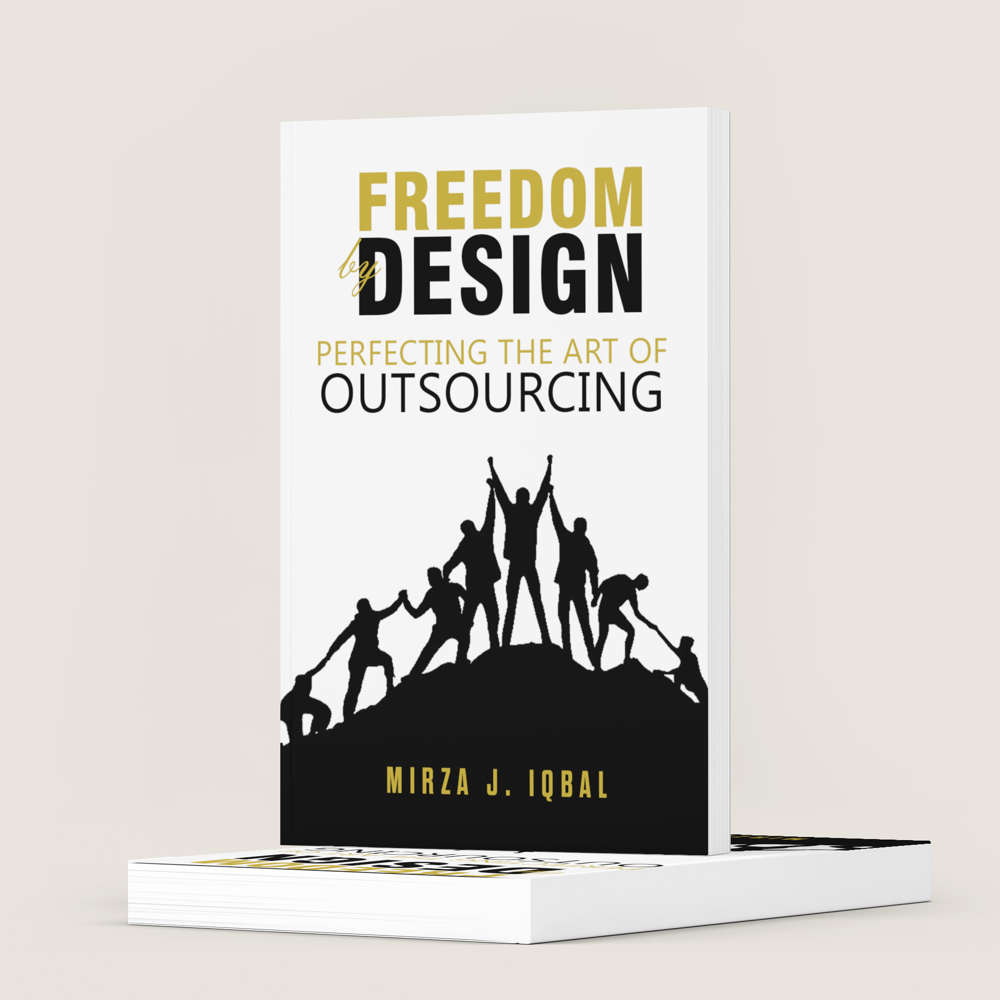

# Freedom by Design 
## Book Title: Freedom by Design
### Author Mirza J. Iqbal
### Release Date 29.July 2023 
#### If you like this Book, Don't forget to Bookmar, Pin, Fork or Star it.
...


### Book Cover & Design 

## Directory Overview
```
freedombydesign/
┣ 00 - Gold Mine - Job Descriptions, Samples and other/
┃ ┣ Chat GPT Prompts.docx
┃ ┣ Employee Interview script.docx
┃ ┣ Employee Onboarding Checklist.xlsx
┃ ┣ Employee Onboarding Email Template.docx
┃ ┣ Job Titles and Descriptions.docx
┃ ┗ One-on-one employee meeting script.docx
┣ 01 - Chapter 1 - Introducton - The Journey to 'Freedom by Design'/
┃ ┣ Chapter 2 - Goodbye Inner Control Freak - Letting Go to Grow/
┃ ┗ Freedombydesign Intro Graphics.png
┣ 02 - Chapter 2 - Goodbye Inner Control Freak - Letting Go to Grow/
┃ ┗ Goodbye Inner Control Freak .png
┣ 03 - Chapter 3 - Challenging the Debt Demon - Your Time to Act/
┃ ┗ Challenging the Debt Demon.png
┣ 04 - Chapter 4 - Progress by Design - Scale with Strategy/
┃ ┗ Progress by Design.png
┣ 05 - Chapter 5 - Beyond Job Descriptions - Creating a Dynamic Workforce/
┃ ┗ Beyond Job Descriptions .png
┣ 06 - Chapter 6 - A Vision-Driven Journey - Dream, Define, Drive/
┃ ┣ A Vision-Driven Journey 2.png
┃ ┗ A Vision-Driven Journey.png
┣ 07 - Chapter 7 - Acknowledging Constraints - Time Talks for Business Needs/
┃ ┗ Acknowledging Constraints.png
┣ 08 - Chapter 8 - Valuing Minutes & Strategic Decision Making - Hire, Delegate, Manage/
┃ ┗ Valuing Minutes & Strategic Decision Makin.png
┣ 09 - Chapter 9 - Visual Roadmap for Hiring Top Talent (1/
┃ ┣ 2) - Scanning for Stars (Practical Blueprint)/
┃ ┣ Aprox time Evaluation.png
┃ ┣ Time-piechart-colored.png
┃ ┣ Time-piechart.png
┃ ┣ Visual Roadmap for Hiring Top Talent 1.png
┃ ┗ Visual Step by Step Guide and overview.png
┣ 10 - Chapter 10 - Visual Roadmap for Hiring Top Talent (2/
┃ ┣ 2) - Practical Blueprint for Contractors or Freelancers/
┃ ┣ Aprox time Evaluation.png
┃ ┣ Visual Roadmap for Hiring Top Talent 2.png
┃ ┗ Visual Step by Step Guide.png
┣ 11 - Chapter 11 - Optimal Hiring 'Action Plan' - Attracting the Right Talent/
┃ ┣ Craiglist Process.png
┃ ┣ Fiverr Process overview.png
┃ ┣ Freelancer.com Process overview.png
┃ ┣ Optimal Hiring Action Plan.png
┃ ┗ Upword Process overview.png
┣ 12 - Chapter 12 - Winning Art of Effective Hiring - Best Practices and Lessons Learned/
┃ ┣ Fiver Best Practices overview and guide.png
┃ ┣ Freelancer.com Best Practices overview and guide.png
┃ ┣ Onlinejobs.ph Best Practices overview and guide.png
┃ ┣ Upwork Best Practices overview and guide.png
┃ ┗ Winning Art of Effective Hiring.png
┣ 97 - Resources/
┃ ┣ Main-Source-XML.drawio
┃ ┣ Starhint.png
┃ ┣ fbd-cover-mockup.png
┃ ┣ freedombydesign.png
┃ ┗ hardbookcoverfbd.png
┣ 98 -  Bonus 2 - The Language of Outsourcing/
┃ ┣ The Language of Outsourcing 1.png
┃ ┣ The Language of Outsourcing 2.png
┃ ┣ The Language of Outsourcing 3.png
┃ ┣ The Language of Outsourcing 4.png
┃ ┗ The Language of Outsourcing 5.png
┣ 99 - Bonus 1 - Notes/
┃ ┣ Notes 1.png
┃ ┣ Notes 2.png
┃ ┗ Notes 3.png
┗ README.md

```


## Disclaimer:

The content provided in this repository is for informational purposes only. All rights reserved. No part of this document may be repurposed, reproduced, or created without written consent. Any unauthorized use or distribution of the content is strictly prohibited.